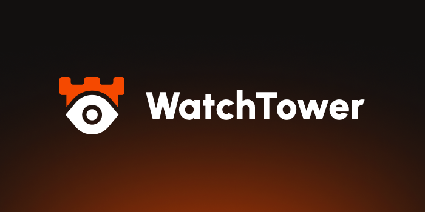

Open Source YouTube clone

- [Developing](#developing)
- [Running](#running)

## Developing

Dependencies:
- Docker (Compose)
- Minio (Recommended)
- Golang
- TensorFlow
- [ProtoBuf](https://protobuf.dev/installation/)
- [libvips](https://www.libvips.org/install.html)

```sh
# Various tools

# Devman (Run many services via one command)
go install github.com/ultravioletasdf/devman@latest
# Air (Hot reload)
go install github.com/air-verse/air@latest
# Atlas (Automatic migrations)
curl -sSf https://atlasgo.sh | sh
# SQLc (Automatic SQL -> Go Bindings)
go install github.com/sqlc-dev/sqlc/cmd/sqlc@latest
# Vips (image processing)
go install github.com/cshum/vipsgen/cmd/vipsgen@latest
# Minio (S3 Server)
go install github.com/minio/minio@latest
# Minio Client
go install github.com/minio/mc@latest
# Protobuf/gRPC plugins
go install google.golang.org/protobuf/cmd/protoc-gen-go@latest
go install google.golang.org/grpc/cmd/protoc-gen-go-grpc@latest
# Templ (Templating language)
go install github.com/a-h/templ/cmd/templ@latest
# Tailwind CSS (CSS Framework)
npm install tailwindcss @tailwindcss/cli
```

### S3 Setup

1. Run minio (`minio server ./tmp/server`)
2. Create an alias:

```sh
mc alias set dev http://127.0.0.1:9000 minioadmin minioadmin
```

3. Set permissions
```sh
mc anonymous set download dev/avatars
mc anonymous set download dev/thumbnails
```

### Vips setup
```sh
# Run this to generate VIPS bindings
make gen/vips
```

## Running

### Environment

Copy `build/.env.example` to `.env` and update the values.

If you have an nvidia gpu, set `TRANSCODE_NVIDIA=true` to make processing videos faster

After that, you can start all needed tools by running `devman`

### Issues

There may be a problem finding tensorflow, to fix this, add the following to `.env`
```
CGO_CFLAGS="-I/usr/include/tensorflow"
CGO_LDFLAGS="-ltensorflow"
```
